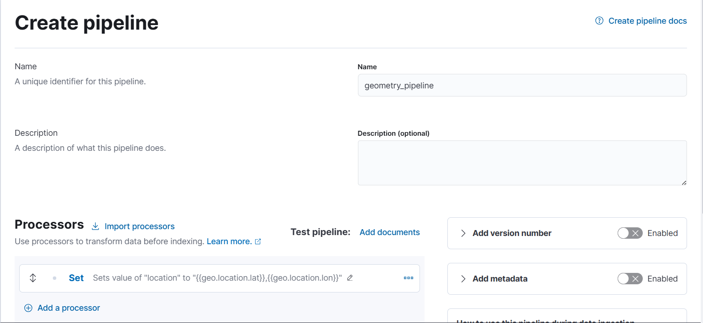
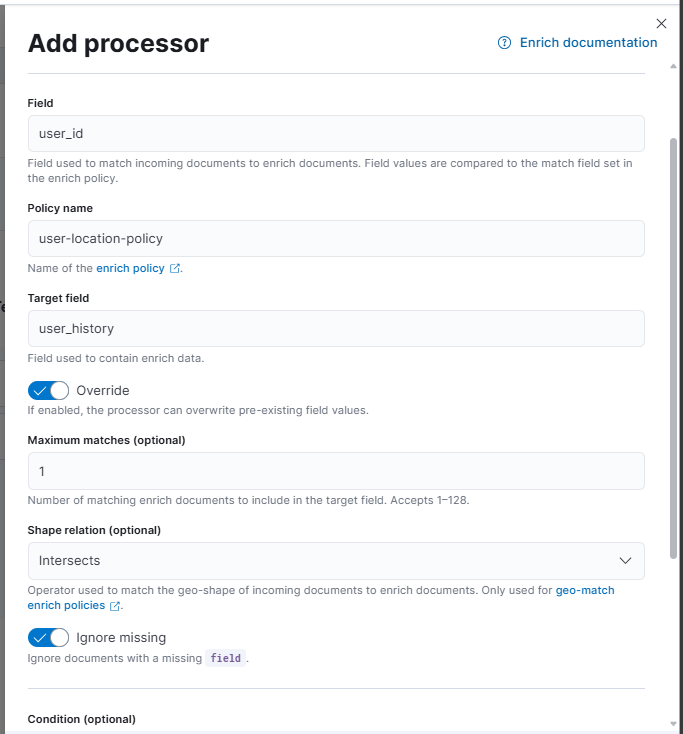

## Rule 1: Multiple successful SSO logins for the same user from geographically distant IPs within short timespan → possible credential theft.

### Any login attempts from locations more than 5,000 km apart within 5 minutes → Impossible travel!

### Kibana setup:

- Stack Management > Ingest Pipelines > Create a pipeline:



- Backfill existing data to populate the new field:


- Create a Transform: Stack Management > Transforms

  - Source: Entire your Data View
  - KQL: `sp: "Keycloak" AND idp: "Keycloak" AND event_type: "LOGIN"`
  - Group by: `user_id`
  - Aggregations:
    - @timestamp: `max`
    - location: `top_metrics`
  - Nhớ bật Continous Mode

- Enrich Policy: Dev Tools

```
PUT /_enrich/policy/user-location-policy
{
  "match": {
    "indices": "user_last_location",
    "match_field": "user_id",
    "enrich_fields": [
      "top_metrics.location.keyword",
      "@timestamp.max"
    ]
  }
}
```

```
POST /_enrich/policy/user-location-policy/_execute
```

- Edit pipeline:

  - Add a processor -> Enrich
  - Ensure the order of processor: Set > Enrich



- Data Views > SSO Logs > Add fields:

  - Name: travel_velocity
  - Type: Double
  - Scripts:

  ```java
  // 1. Hàm tính khoảng cách Haversine (Bắt buộc dùng vì không có Geo-Point chuẩn)
  double calculateDistance(double lat1, double lon1, double lat2, double lon2) {
    double R = 6371.0;
    double dLat = Math.toRadians(lat2 - lat1);
    double dLon = Math.toRadians(lon2 - lon1);
    double a = Math.sin(dLat / 2) * Math.sin(dLat / 2) +
               Math.cos(Math.toRadians(lat1)) * Math.cos(Math.toRadians(lat2)) *
               Math.sin(dLon / 2) * Math.sin(dLon / 2);
    double c = 2 * Math.atan2(Math.sqrt(a), Math.sqrt(1 - a));
    return R * c;
  }
  // 2. MAIN LOGIC
  // Kiểm tra xem có 2 cột số lat/lon rời rạc không (Dựa trên ảnh của bạn)
  if (doc.containsKey('geo.location.lat') && !doc['geo.location.lat'].empty &&
  doc.containsKey('geo.location.lon') && !doc['geo.location.lon'].empty &&
  doc.containsKey('user_history.top_metrics.location.keyword') && !doc['user_history.top_metrics.location.keyword'].empty &&
  doc.containsKey('user_history.@timestamp.max')) {
    try {
        // Lấy toạ độ hiện tại từ 2 trường số riêng biệt
        double curLat = doc['geo.location.lat'].value;
        double curLon = doc['geo.location.lon'].value;

        // Lấy toạ độ quá khứ (Dạng chuỗi "lat,lon" từ Enrich)
        String histLocStr = doc['user_history.top_metrics.location.keyword'].value;
        int commaIndex = histLocStr.indexOf(',');

        if (commaIndex > 0) {
            double histLat = Double.parseDouble(histLocStr.substring(0, commaIndex).trim());
            double histLon = Double.parseDouble(histLocStr.substring(commaIndex + 1).trim());

            // Tính toán
            double distKm = calculateDistance(curLat, curLon, histLat, histLon);

            long currentMillis = doc['@timestamp'].value.toInstant().toEpochMilli();
            long historyMillis = doc['user_history.@timestamp.max'].value.toInstant().toEpochMilli();
            double timeDiffHr = (currentMillis - historyMillis) / 3600000.0;

            // Hạ ngưỡng lọc xuống 0 để test (Bắt mọi di chuyển)
            if (timeDiffHr > 0.0001 && distKm > 0.1) {
                emit(distKm / timeDiffHr);
            } else {
                emit(0.0);
            }
        }
    } catch (Exception e) {
        emit(0.0);
    }
  }
  ```

- Set rule: Every logs need to go through `geometry_pipeline`

```
PUT /sso-logs-*/_settings
{
  "index.default_pipeline": "geometry_pipeline"
}

PUT _index_template/sso_logs_template_custom
{
  "index_patterns": ["sso-logs-*"],
  "priority": 500,
  "template": {
    "settings": {
      "index.default_pipeline": "geometry_pipeline"
    }
  }
}
```

- Set alert rules: Stack Management > Rules


