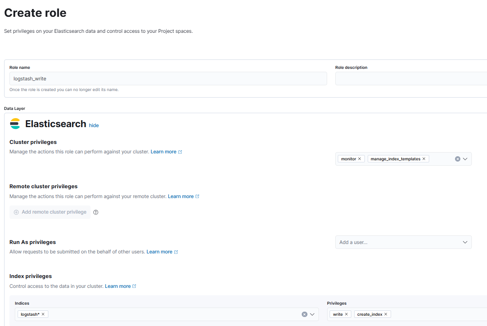

# Cài Đặt ELK Dashboard

Trick: Nếu sửa file bằng Remote - SSH của VS Code:

```bash
# Thay doi quyen` cho user hien tai
sudo chown -R $USER:$USER /etc/logstash
# Tra quyen cho service
sudo chown -R root:logstash /etc/logstash
```

Nhớ cài Logstash Extension cho đỡ viết khổ

## Step 1: Chuẩn bị môi trường trên máy giám sát (Monitor)

Cài đặt các gói cần thiết và cập nhật hệ thống:

```bash
sudo apt update && sudo apt upgrade -y
sudo apt install net-tools vim curl wget -y
```

Thêm GPG Key và repository của ELK Stack:

```bash
sudo wget https://artifacts.elastic.co/GPG-KEY-elasticsearch -O /etc/apt/keyrings/GPG-KEY-elasticsearch.key
sudo echo "deb [signed-by=/etc/apt/keyrings/GPG-KEY-elasticsearch.key] https://artifacts.elastic.co/packages/8.x/apt stable main" | sudo tee /etc/apt/sources.list.d/elastic-8.x.list
sudo apt update
```

Tắt sleep:

```bash
sudo nano /etc/systemd/sleep.conf
```

```conf
[Sleep]
AllowSuspend=no
AllowHibernation=no
AllowSuspendThenHibernate=no
AllowHybridSleep=no
```

```bash
sudo systemctl daemon-reexec
```

---

## Step 2: Cài đặt ELK Stack

### 2.1: Cài đặt Java

```bash
sudo apt install openjdk-17-jdk -y
java -version
```

### 2.2: Cài đặt Elasticsearch

```bash
sudo apt install elasticsearch -y
sudo systemctl daemon-reload
sudo systemctl start elasticsearch
sudo systemctl enable elasticsearch
sudo systemctl status elasticsearch
```

Config Elasticsearch:

```bash
sudo nano /etc/elasticsearch/elasticsearch.yml
```

```yaml
network.host: 0.0.0.0
xpack.security.enabled: false
```

Lưu thay đổi & kiểm tra:

```bash
sudo systemctl restart elasticsearch
curl -X GET "localhost:9200"
```

### 2.3: Cài đặt Kibana

```bash
sudo apt install kibana -y
sudo systemctl start kibana
sudo systemctl enable kibana
sudo systemctl status kibana
```

Config Kibana:

```bash
sudo nano /etc/kibana/kibana.yml
```

```yaml
server.port: 5601
server.host: 0.0.0.0
elasticsearch.hosts: ["http://localhost:9200"]
```

```bash
sudo systemctl restart kibana
```

Truy cập Kibana: http://localhost:5601

### 2.4: Cài đặt Logstash

```bash
sudo apt install logstash -y
sudo systemctl start logstash
sudo systemctl enable logstash
sudo systemctl status logstash
```

---

## Step 3: Kích hoạt HTTPS

### Create TLS Certificates

Create instance yaml file

```bash
sudo nano ~/tmp/instance.yml
```

```yaml
instances:
  - name: "elasticsearch"
    dns: ["localhost", "monitor"]
    ip: ["127.0.0.1", "100.100.86.118"]
  - name: "kibana"
    dns: ["localhost", "monitor"]
    ip: ["127.0.0.1", "100.100.86.118"]
  - name: "logstash"
    dns: ["localhost", "monitor"]
    ip: ["127.0.0.1", "100.100.86.118"]
```

Generate CA and server certificates:

```bash
sudo /usr/share/elasticsearch/bin/elasticsearch-certutil ca --pem --out ~/tmp/elastic-stack-ca.zip
sudo unzip ~/tmp/elastic-stack-ca.zip -d ~/tmp/ca
sudo /usr/share/elasticsearch/bin/elasticsearch-certutil cert \
  --ca-cert ~/tmp/ca/ca/ca.crt \
  --ca-key ~/tmp/ca/ca/ca.key \
  --pem \
  --in ~/tmp/instance.yml \
  --out ~/tmp/certs.zip
```

Unzip the certificates

```bash
cd ~/tmp
sudo mkdir /etc/elasticsearch/certs
sudo unzip certs.zip -d ./certs
```

### Elasticsearch TLS setup

Copy cert file to config folder

```bash
cd $ES_PATH_CONF
sudo cp ~/tmp/ca/ca/ca* ~/tmp/certs/elasticsearch/* /etc/elasticsearch/certs
```

Configure elasticsearch.yml

```yaml
## add the following contents
xpack.security.enabled: true

xpack.security.http.ssl:
  enabled: true
  key: certs/elasticsearch.key
  certificate: certs/elasticsearch.crt
  certificate_authorities: ["certs/ca.crt"]

xpack.security.transport.ssl:
  enabled: true
  verification_mode: certificate
  key: certs/elasticsearch.key
  certificate: certs/elasticsearch.crt
  certificate_authorities: ["certs/ca.crt"]
```

Restart and check cluster log

```bash
sudo systemctl restart elasticsearch
sudo grep 'started' /var/log/elasticsearch/elasticsearch.log
```

Set built-in user password

```bash
sudo /usr/share/elasticsearch/bin/elasticsearch-reset-password -u elastic --url "https://localhost:9200" -i
This tool will reset the password of the [elastic] user.
You will be prompted to enter the password.
Please confirm that you would like to continue [y/N] y
Enter password for [elastic]:
Re-enter password for [elastic]:
Password for the [elastic] user successfully reset.

# Do the same for Kibana and Logstash
sudo /usr/share/elasticsearch/bin/elasticsearch-reset-password -u kibana --url "https://localhost:9200" -i
sudo /usr/share/elasticsearch/bin/elasticsearch-reset-password -u logstash --url "https://localhost:9200" -i
```

Access \_cat/nodes API via HTTPS

```bash
curl --cacert /home/tung/tmp/ca/ca/ca.crt -u elastic 'https://localhost:9200/_cat/nodes?v'
Enter host password for user 'elastic':
ip             heap.percent ram.percent cpu load_1m load_5m load_15m node.role   master name
100.100.86.118           36          94  41    3.54    3.88     3.79 cdfhilmrstw *      monitor
```

### Enable TLS for Kibana

Copy cert file to config folder

```bash
sudo mkdir /etc/kibana/certs
sudo cp ~/tmp/ca/ca/ca* ~/tmp/certs/kibana/* /etc/kibana/certs
```

Configure `/etc/kibana/kibana.yml`

```yaml
server.ssl.enabled: true
server.ssl.certificate: /etc/kibana/certs/kibana.crt
server.ssl.key: /etc/kibana/certs/kibana.key
elasticsearch.hosts: ["https://localhost:9200"]
elasticsearch.username: "kibana"
elasticsearch.password: "<kibana_password>"
elasticsearch.ssl.certificateAuthorities: ["/etc/kibana/certs/ca.crt"]
```

Restart

```
sudo systemctl restart kibana
```

Login in https://localhost:5601 with **elasticsearch** user credentials

### Prepare Logstash users

Setup as pictures below




### Enable TLS for Logstash

Copy cert file to config folder

```bash
sudo mkdir /etc/logstash/certs
sudo cp ~/tmp/ca/ca/ca* ~/tmp/certs/logstash/* /etc/logstash/certs
```

Convert `logstash.key` to PKCS#8 format for Beats input plugin

```bash
sudo openssl pkcs8 -in /etc/logstash/certs/logstash.key -topk8 -nocrypt -out /etc/logstash/certs/logstash.pkcs8.key
```

Configure `logstash.yml` and restart:

```yaml
xpack.monitoring.enabled: true
xpack.monitoring.elasticsearch.username: logstash_system
xpack.monitoring.elasticsearch.password: <logstash_password>
xpack.monitoring.elasticsearch.hosts: ["https://localhost:9200"]
xpack.monitoring.elasticsearch.ssl.certificate_authority: /etc/logstash/certs/ca.crt
```

```
sudo systemctl restart logstash
```

Paste files in [Logstash_conf](Logstash_conf/) folder to `/etc/logstash/conf.d`

### Use Filebeat to ingest data

Download [Filebeat](Filebeat/) folder, then:

```bash
cd Filebeat
sudo docker compose up -d
```

Debug Flow

```bash
sudo journalctl -u logstash -n 50 --no-pager
sudo docker compose logs -f
```
